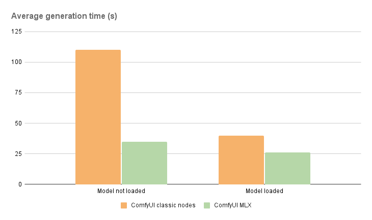

# ComfyUI MLX Nodes

Faster workflows for ComfyUI users on Mac with Apple silicon

## Installation

1. Install the MLX nodes from the Custom Nodes Manager:
    
 - In ComfyUI, Manager > Custom Nodes Manager > Tap 'ComfyUI MLX' > Click Install 

 OR 
 
 - In ComfyUI, Manager > Install via Git URL > https://github.com/thoddnn/ComfyUI-MLX.git

## Performances 

Given the following environment: 

- Device: MacBook M2 Max, 96 GB

- Model: Flux 1.0 dev (not quantized)

- Size: 512x512

- Prompt: Photo of a cat

- Steps: 10

I get approximatively:

- 70% faster when the model needs to be loaded

- 35% faster when the model is loaded

- 30% lower memory usage

## Getting Started

A basic workflow is provided to help you start experimenting with the nodes [here](./workflows/basic_workflow.json).

## Why ComfyUI MLX Nodes?

I started building these nodes because image generation from Flux models was taking too much time on my MacBook. After discovering DiffusionKit on X, which showcased great performance for image generation on Apple Silicon, I decided to create a quick port of the library into ComfyUI.

The goal is to collaborate with other contributors to build a full suite of custom nodes optimized for Apple Silicon. 

Additionally, we aim to minimize the reliance on torch to take full advantage of future MLX improvements and further enhance performance.

This will allow ComfyUI users on Mac with Apple Silicon to experience faster workflows.

## Contributing 

Contributions are welcome! I'm open to best practices and suggestions and you’re encouraged to submit a Pull Request to improve the project. 🙏

## Future Plans

- Loading models from local file 
- SDXL models support
- ControlNet support
- LoRA support 
- LLM and VLM nodes
- CogXVideo models support  
- Build more MLX based nodes for common workflows (based on your requests)

## License

ComfyUI MLX Nodes is released under the MIT License. See [LICENSE](LICENSE) for more details.

## Acknowledgements

- [DiffusionKit](https://github.com/argmaxinc/DiffusionKit)

## Support

If you encounter any problems or have any questions, please open an issue in this repository.